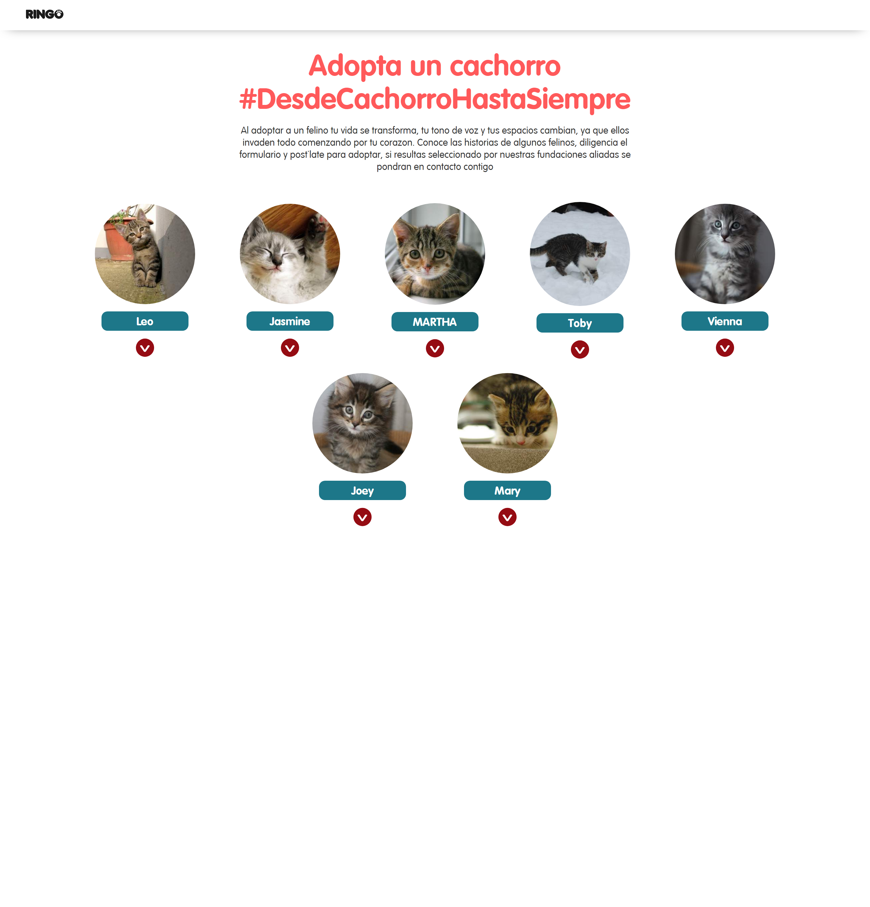
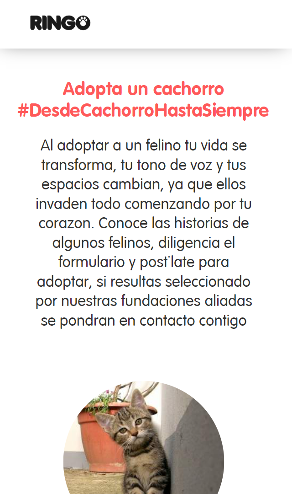
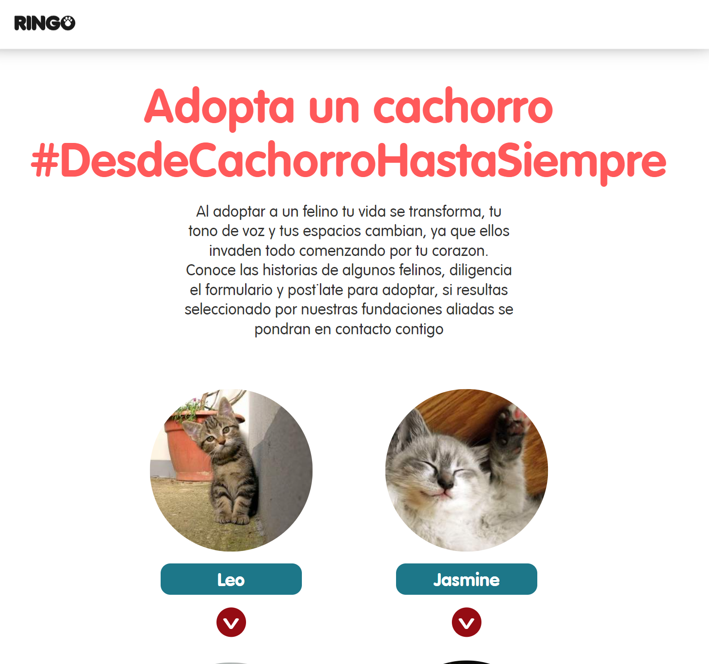
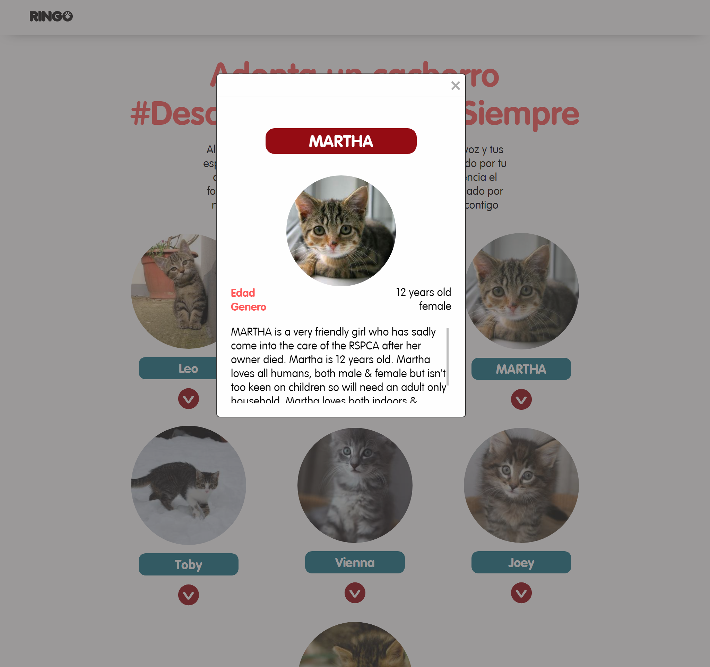

# Interview Code Challenges

Holakittens instructions
Hey there!

Are you ready to make a super cute app featuring adorable kittens? Great! Here's what you'll need to do:

Use a language you're comfortable with (like NodeJS, Rails, or Java) to create a simple REST API with a single endpoint called /kittens. This endpoint should return the "kittens.json" data (or a similar version of it). You don't need to worry about storing the data - just mock it up for now.

Next, use React to create an app that displays the kittens from the API. You can use a library like Axios to fetch the data from the API. Your app should show a list of all the kittens at first, and then allow the user to select a specific kitten to see more details about it. While the app is waiting for the API request to finish, display a spinner or placeholder component. Make sure your app looks decent and is somewhat responsive, so it doesn't look terrible on mobile phones.

## Run Locally

Clone the project

```bash
  git clone https://link-to-project
```

Go to the project directory

```bash
  cd my-project
```

Install dependencies

```bash
  npm install
```

Start the server

```bash
  npm run dev
```

## Screenshots









## Demo

Insert gif or link to demo
